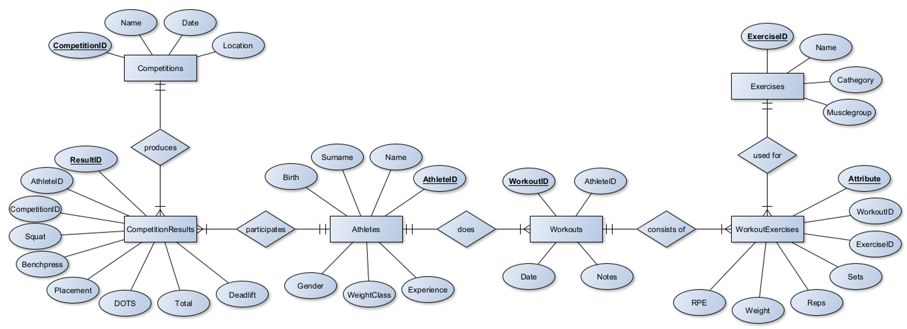

# Design Document

By Thomas Engelmann

Video overview: <[URL HERE](https://youtu.be/seFOit2lA7c)>

## Scope

This CS50 SQL Database is meant for tracking powerlifting (and other) athles in their workouts and respective competitions.
As such the database contains:

° Athletes, containig basic information and special attributes neccessary for the sport like weightclass and experience.
° Competitions, stating the name, date and location of a certain competition.
° CompetitionResults, containing detailled results and very precise information about powerlifting like the three main lifts, the resulting total wight moved, the DOTS point system and the placement of the corresponding athlete.
° Workouts as a connection Table to show which workout a certain athlete has done. This serves as a connection table to the WorkoutExercices.
° WorkoutExercises contain the collection of exercises done by a certain athlete in a corresponding workout. It contains the number of sets, reps, weight moved (if there is weight) and RPE scale.
° Exercises is a table cinnecte to WorkoutExercises in which the latter gets its content from. You can fill up the exercise table as you like and combine new exercises or remove some for the workouts done by each athlete.

In this database other competitions than powerlifting are not yet implementet. The limitation is, that new tables would need to be made for every other kind of competition thus needing a new arrangement of the database. You could rename the CompetitionResults table into e.g. PowerliftingResults table and make a cconnection table for competitions. Then you could connect this with foreign keys to every kin of event table not only for powerlifting.

## Functional Requirements

* What should a user be able to do with your database?
Basically every table in the database can be modified if the statements are know, to insert, modify or delete athletes, competitions and their results, workouts and their exercises. It can be used to track multiple athletes within their training proces, documenting on a scalable level the results of their workout sessions and any given competitions. NEw exercises can bew moved. The database could be a front end for data science to since workouts are scalable in number of exercises and sets.

* What's beyond the scope of what a user should be able to do with your database?
The ist no implementation for athlete comments except a `note` the user can set. Also as mentioned for now, the database only supports powerlifting and would be in need of a rework to support other sports.

## Representation

### Entities

### Entities

°`Athletes`
- `AthleteID` INTEGER NOT NULL PRIMARY KEY AUTOINCREMENT: Serves as a unique identifier for each athlete. Using INTEGER ensures unique values, with automatic increment for convenience and integrity.
- `Name` TEXT NOT NULL: Stores the athlete's first name. It must be provided, as names are essential for identification.
- `Surname` TEXT NOT NULL: Stores the athlete's last name. This is also mandatory for complete identification.
- `Birth` DATE NOT NULL: Records the athlete's birth date in DATE format for ease of handling and calculating age. This field is required.
- `Gender` TEXT: Allows NULL values to accommodate various gender identities and maintain inclusivity.
- `WeightClass` TEXT NOT NULL: Required for categorizing athletes by weight class in powerlifting. TEXT is used for flexibility in representing weight categories.
- `Experience` TEXT NOT NULL: Captures the athlete's experience level in text form to allow for varied descriptions.

°`Workouts`
- `WorkoutID` INTEGER NOT NULL PRIMARY KEY AUTOINCREMENT: Unique identifier for each workout, ensuring distinct records and ease of reference.
- `AthleteID` INTEGER NOT NULL: Foreign key linking to the `Athletes` table. Must be present to connect workouts to specific athletes, ensuring relational integrity.
- `Date` DATE NOT NULL: Records the date of the workout. DATE format simplifies tracking progress over time and is required.
- `notes` TEXT NOT NULL: Allows coaches to add observations or comments about the workout. This field must be filled to ensure comprehensive documentation.
- FOREIGN KEY (`AthleteID`) REFERENCES `Athletes` (`AthleteID`): Establishes the relationship between workouts and athletes, enforcing data consistency.

°`Exercises`
- `ExerciseID` INTEGER NOT NULL PRIMARY KEY AUTOINCREMENT: Unique identifier for each exercise, facilitating easy reference and differentiation.
- `Name` TEXT NOT NULL: Stores the name of the exercise. This field is required to specify which exercises are performed.
- `Category` TEXT NOT NULL: Classifies exercises into categories, aiding in the organization and selection for workouts. This field must be filled.
- `Musclegroup` TEXT NOT NULL: Indicates which muscle group the exercise targets, essential for workout planning.

°`WorkoutExercises`
- `WorkoutExerciseID` INTEGER NOT NULL PRIMARY KEY AUTOINCREMENT: Unique identifier for each exercise performed within a workout, ensuring distinct records.
- `WorkoutID` INTEGER NOT NULL: Foreign key linking to the `Workouts` table. This must be present to connect exercises to specific workouts.
- `ExerciseID` INTEGER NOT NULL: Foreign key linking to the `Exercises` table. Required to identify which exercise was performed.
- `Sets` NUMERIC NOT NULL: Records the number of sets performed, allowing for fractional values if necessary. This field must be filled.
- `Reps` NUMERIC: Records the number of repetitions, with flexibility for fractional values and optionality for exercises without repetitions.
- `Weight` NUMERIC: Stores the weight used, allowing for small increments. This field is optional for exercises where weight is not applicable.
- `RPE` NUMERIC NOT NULL: Records the perceived exertion level, which can be expressed in decimal values. This field is required to assess workout intensity.
- FOREIGN KEY (`WorkoutID`) REFERENCES `Workouts` (`WorkoutID`): Connects each exercise record to a specific workout.
- FOREIGN KEY (`ExerciseID`) REFERENCES `Exercises` (`ExerciseID`): Connects each exercise entry to a specific exercise.

°`Competitions`
- `CompetitionID` INTEGER NOT NULL PRIMARY KEY AUTOINCREMENT: Unique identifier for each competition, ensuring distinct entries.
- `Name` TEXT NOT NULL: Stores the name of the competition. This is required for identifying the event.
- `Date` DATE NOT NULL: Records the date of the competition in DATE format, essential for tracking and scheduling.
- `Location` TEXT NOT NULL: Indicates where the competition took place, necessary for event details.

°`CompetitionResults`
- `ResultID` INTEGER NOT NULL PRIMARY KEY AUTOINCREMENT: Unique identifier for each result entry, ensuring clear and separate records.
- `AthleteID` INTEGER NOT NULL: Foreign key linking to the `Athletes` table. Required to associate results with specific athletes.
- `CompetitionID` INTEGER NOT NULL: Foreign key linking to the `Competitions` table. Necessary for associating results with specific competitions.
- `Squat` NUMERIC NOT NULL: Records the squat result in competition, requiring NUMERIC format for precision.
- `Benchpress` NUMERIC NOT NULL: Records the bench press result, also requiring NUMERIC format for consistency.
- `Deadlift` NUMERIC NOT NULL: Records the deadlift result, with NUMERIC format for precise measurement.
- `Total` NUMERIC NOT NULL: Sum of the squat, bench press, and deadlift results, recorded in NUMERIC format.
- `DOTS` NUMERIC NOT NULL: Represents the DOTS score, calculated from the total and body weight, requiring NUMERIC format.
- `Placement` INTEGER NOT NULL: Stores the athlete's placement, using INTEGER format as placements are whole numbers.
- FOREIGN KEY (`AthleteID`) REFERENCES `Athletes` (`AthleteID`): Ensures the result is associated with a valid athlete.
- FOREIGN KEY (`CompetitionID`) REFERENCES `Competitions` (`CompetitionID`): Ensures the result is linked to a specific competition.

### Relationships

I made the entity relation diagram with yEd. This free software looks a bit funny but it is wide spread. The attributes are shown as little bubbles around the entities.
Primary keys are bold and underlined. The rombic blocks represent relations to better imagine what the database does. Cardinality notation is conventional.

° `Athletes` to `Workouts` is 1:n (one to many relationship): Each athlete can participate in multiple workouts, but each workout belongs to only one athlete.

° `Athletes` to `CompetitionResults` is 1:n (one to many relationship): Each athlete can have multiple competition results, but each result refers to only one athlete.

° `Workouts` to `WorkoutExercises` is 1:n (one to many relationship): Each workout consists of multiple exercises, but each exercise set belongs to one specific workout.

° `Exercises` to `WorkoutExercises` is 1:n (one to many relationship): One exercise can appear in multiple workout sessions, but each entry in WorkoutExercises refers to one exercise.

° `Competitions` to `CompetitionResults` is 1:n (one to many relationship): Each competition has multiple results from different athletes, but each result is linked to one specific competition.

° `CompetitionResults` - `Athletes & Competitions` n:1 (many to one telationship): Multiple results link back to one athlete and one competition, meaning an athlete can compete in many events, and each result comes from one competition.

° `WorkoutExercises` and `CompetitionResults` act both as information carriers and as junction tables, connecting the adjacent tables.

## Optimizations

`CREATE INDEX idx_workouts_athleteid ON "Workouts" ("AthleteID");`
Creates an index on the "Workouts" table to speed up queries that search for workouts by athleteID. This is what we most often will search for.

`CREATE INDEX idx_competitionresults_competitionid ON "CompetitionResults" ("CompetitionID");`
Creates an index on the "CompetitionResults" table to optimize queries that involve competition IDs,
as competitions are a primary interest of this database and will grow exponentionally with more athles in the future.

`CREATE INDEX idx_athletes_name ON "Athletes" ("Name");`
Creates an index on the "Athletes" table to improve the speed of lookups based on athlete names,
as you often search for athletes by their name and thereafter for their workouts.

## Limitations

The design has notable limitations. It is restricted to powerlifting and would require substantial schema modifications to accommodate other sports. The database does not support advanced athlete comments, offering only basic notes instead.

The database may struggle to represent complex multi-sport events or non-standard competitions. It also lacks detailed progress tracking or advanced analytics beyond basic results. Furthermore, it does not account for athlete injuries, rest periods, or recovery protocols. There ist also no history fo deletion or manipulation of entries.
